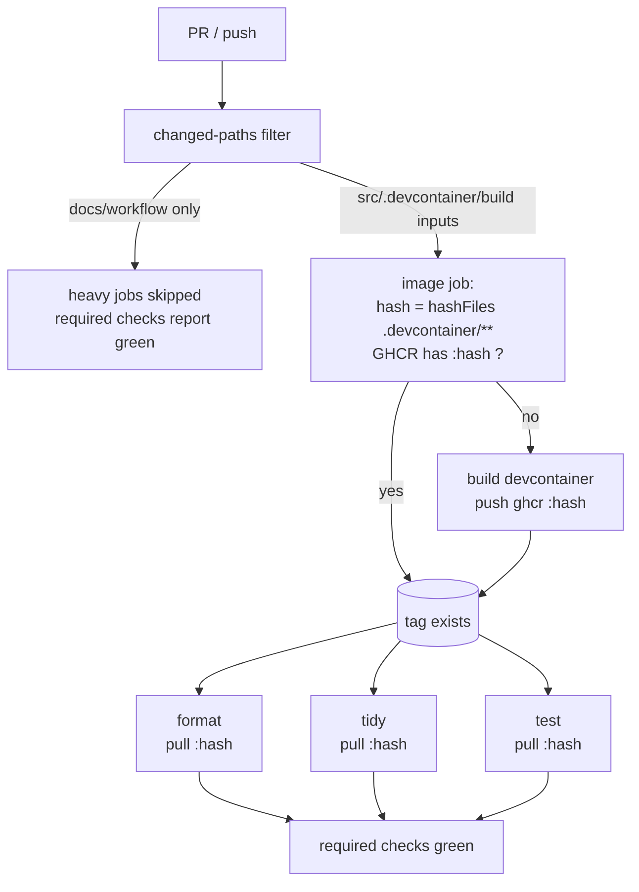

# feat: Reuse a content-hashed prebuilt cross-compile image to speed up CI

## Summary

Stop rebuilding the devcontainer image on every CI job. Build it **once per `.devcontainer/**` content** and reuse it: a single `image` job computes a content-hash tag, pulls `ghcr.io/.../sst-cam-firmware-devcontainer:<hash>` if it exists, otherwise builds and pushes it; the `format`/`tidy`/`test` checks and the release cross-build then `needs:` that job and pull the same image. Add a path filter so docs/workflow-only PRs skip the heavy jobs entirely, keeping required-status-checks green.

---

## Problem Frame

PR CI takes 15–20 min because the ~3 GB BSP devcontainer image is rebuilt from scratch by `format`, `tidy`, and `test` independently (3× the same build per run), and again by the release jobs — even though a `src/**`-only PR changes **zero** image layers. (See origin: `docs/brainstorms/2026-06-23-cicd-speedup-prebuilt-image-requirements.md`.)

---

## Requirements

- R1. A `src/**`-only PR runs `format`/`tidy`/`test` **without rebuilding** the devcontainer image (pull/reuse), with materially lower wall-time than today's ~15–20 min.
- R2. The devcontainer image is built **once per `.devcontainer/**` content** and reused across branches/PRs/runs; a content change triggers exactly one rebuild, then reuse.
- R3. The three check jobs remain **parallel**.
- R4. A docs/workflow-only PR (no `src/**`, `tests/**`, `.devcontainer/**`, `conanfile.py`, `CMakeLists.txt`/`cmake/**` change) **skips the heavy jobs** and still satisfies branch protection (all required checks green, not "pending").
- R5. Image consumption is safe: no consumption of a mutable `:latest`; a PR can only influence the image for its **own** `.devcontainer` content; fork PRs (read-only token) cannot push images.
- R6. The pull fits hosted-runner disk (post `free-disk-space`); if a pull fails, the job falls back to building so CI never hard-blocks on the optimization.
- R7. Stable promotion (`release.yml`) stays no-build and unaffected.

**Origin trace:** origin is Standard-tier (no A/F/AE IDs). R1–R7 derived from origin success criteria + the content-hash decision made during planning.

---

## Scope Boundaries

- No self-hosted runner (origin deferral).
- No BSP image slimming (dropping kernel/DTB from `apply_binaries`); no `ccache`.
- No change to the alpha/beta/stable ladder, the required-check **job names** (`ci-scripts`/`format`/`tidy`/`test`), `resolve-version.sh`, or the no-build stable promotion.
- Conan cache (`~/.conan2` keyed on `conanfile.py`) stays as-is.

### Deferred to Follow-Up Work

- Self-hosted runner as the durable answer if hosted-runner pull economics disappoint: future iteration.
- `ccache` for cross-compile objects; BSP image slimming: future iteration.
- BuildKit `type=gha` layer cache as an alternative/secondary: only if the content-hash GHCR path underperforms (origin's named fallback) — not built here.

---

## Context & Research

### Relevant Code and Patterns

- `.github/workflows/devcontainer-image.yml` — the **existing** GHCR publisher (build + `docker tag sst-cam-firmware → ghcr.io/...:latest` + push, digest resolved via `docker buildx imagetools inspect`). Currently push-to-`main`-only, consumers unwired. This plan **repurposes** its build+push logic into a content-hash, in-CI mechanism.
- `.github/workflows/release-alpha.yml`, `release-beta.yml` — own `development` / `release/**`. Each has `ci-scripts`/`format`/`tidy`/`test` PR-check jobs + push-triggered release jobs. Every devcontainer-building job: `jlumbroso/free-disk-space` → checkout (submodules) → `docker/setup-qemu-action` → `devcontainers/ci@v0.3` (`push: never`, builds the compose service image `sst-cam-firmware`). Conan cache via `actions/cache@v4` on `~/.conan2`. Job names are byte-identical required status checks.
- `.github/workflows/release.yml` — `main` promotion, no build. Unaffected.
- `.devcontainer/docker-compose.yml` — compose service `app` builds `image: sst-cam-firmware` from `../` context, `.devcontainer/Dockerfile`. The local image name `sst-cam-firmware` is the reuse handle.
- `.devcontainer/Dockerfile` + `.devcontainer/sysroot/{001_fetch_bsp_rootfs,003_install_extra_pkgs,002_fix_sysroot}.sh` + `noble-deb-urls.txt` — the full image recipe; all under `.devcontainer/**`, so `hashFiles('.devcontainer/**')` captures it. The image does NOT bake conan deps (only the conan tool), so the recipe is `.devcontainer/**` alone.

### Institutional Learnings

- `docs/solutions/tooling-decisions/ci-cd-release-pipeline-2026-06-15.md` — hosted runner ~14 GB free can't unpack the sysroot → `free-disk-space` first; GHCR publish needs `docker/login-action` (its absence was the original GHCR failure); the GHCR-consume wire-in was deliberately measurement-gated.
- `devcontainer-image.yml` header — security model: NO `pull_request` publish trigger (fork PRs must never get `packages: write`); consume by `@sha256`, never `:latest`. This plan's content-hash tag is the pin (the tag IS the recipe content); fork PRs keep read-only tokens and cannot push (they build locally).
- The clang-tidy job is the long pole (~26 min) — a cache hit here is the biggest single win.

### External References

- `docker/setup-qemu-action` (already used), `devcontainers/ci@v0.3` (`cacheFrom`/`push` knobs), GHCR via `docker/login-action` + `GITHUB_TOKEN` (`packages: write`), `hashFiles()` for the content tag, `paths`/`paths-ignore` + required-check semantics. Well-trodden; no external research needed.

---

## Key Technical Decisions

- **Content-hash image tag, build-or-pull in CI.** Tag = `hashFiles('.devcontainer/**')`. An `image` job pulls `:<hash>` if present, else builds (reusing `devcontainer-image.yml`'s build+push logic) and pushes `:<hash>`. Dissolves the branch/freshness/staleness/security knot the main-only publisher had: the image for a given recipe is built once ever, every same-recipe consumer pulls it, and a malicious push can only land under that exact recipe's hash (which only that PR consumes).
- **One `image` job; checks `needs:` it.** Collapses the 3× parallel rebuild into one build-or-pull. `format`/`tidy`/`test` depend on it and pull the local image — parallel preserved (R3), redundant builds gone (R1).
- **Reuse handle = the compose image name `sst-cam-firmware`.** The `image` job leaves/pulls-and-tags the image as `sst-cam-firmware`; `devcontainers/ci` with `push: never` finds it already built (compose `image:` cache hit) → skips the build. (Exact knob — pre-tag vs `cacheFrom` — deferred to implementation.)
- **Build fallback on pull failure (R6).** Pull is wrapped so an ENOSPC / missing-image / registry error falls back to a local build (status quo). CI never hard-blocks on the optimization.
- **Security: fork-safe by construction (R5).** The `image` job's push step runs only when the token has `packages: write` (same-repo). Fork PRs (read-only `GITHUB_TOKEN`) skip the push and build locally — they can neither poison nor benefit, matching the existing model's intent without a `pull_request` publish trigger on a privileged workflow.
- **Path filter via required-check-safe skipping (R4).** Heavy jobs gate on changed paths; because their names are required status checks, skipped paths must still report success (path-aware required checks, or a lightweight always-green stand-in) — never left pending. Exact mechanism chosen in U5.
- **Retire the standalone `devcontainer-image.yml` publisher.** Its build+push logic moves into the in-CI `image` job; the main-only workflow is removed or reduced to a manual warm-cache dispatch. (Decision finalized in U6.)

---

## Open Questions

### Resolved During Planning

- Publish scope (main-only vs branches vs content-hash) → **content-hash tag, build-or-pull in CI** (origin + user decision). Removes branch coupling.
- Does the image depend on anything outside `.devcontainer/**`? → No (conan deps are not baked; only the tool is). `hashFiles('.devcontainer/**')` is the complete recipe key.
- Keep checks parallel? → Yes; one `image` job + `needs:` fan-out.

### Deferred to Implementation

- **Exact reuse knob**: pre-`docker pull` + `docker tag … sst-cam-firmware` so compose finds it, vs `devcontainers/ci` `cacheFrom: ghcr.io/...:<hash>`. Pick whichever actually skips the rebuild in a canary run.
- **Sharing the local image across `needs:` jobs**: each job runs on a fresh runner, so "the `image` job built it" doesn't put the image on the check runners — each check job must itself `docker pull :<hash>` (fast). The `image` job's role is to *guarantee the tag exists* (build+push on miss) so the checks' pulls always hit. Confirm this fan-out shape in implementation.
- **Required-check mechanism for skipped paths** (path-aware branch-protection vs green-stub job with the same name) — depends on what the repo's ruleset supports; resolve against the live ruleset at implementation.
- **Peak-disk headroom** of a real pull on a hosted runner post-`free-disk-space` — measured on the first canary run (R6); informs whether `docker-images:false`/extra prune is needed.
- **Concurrency on a cold hash**: if multiple jobs/PRs first hit a new hash simultaneously, they may race to build+push the same tag. GHCR last-writer-wins on an identical recipe is benign; confirm no job fails on a push race (treat "tag already exists" as success).

---

## High-Level Technical Design

> *This illustrates the intended approach and is directional guidance for review, not implementation specification. The implementing agent should treat it as context, not code to reproduce.*

Per-recipe the BUILD branch runs once *ever*; every later run takes the `tag exists` → pull path. Checks stay parallel; each pulls the pinned `:hash` on its own runner.

---

## Implementation Units

- U1. **`image` job: content-hash build-or-pull (GHCR)**

**Goal:** A reusable job (or composite action) that guarantees `ghcr.io/.../sst-cam-firmware-devcontainer:<hash>` exists for the current `.devcontainer/**`, building+pushing only on a miss.

**Requirements:** R2, R5, R6

**Dependencies:** None

**Files:**
- Create: `.github/actions/ensure-devcontainer-image/action.yml` (composite: compute hash, login GHCR, `manifest inspect` → pull-or-build-and-push, fallback to local build) — or an inline reusable job; pick in implementation.
- Modify: `.github/workflows/release-alpha.yml`, `.github/workflows/release-beta.yml` (add the `image` job)

**Approach:**
- `TAG=$(echo "${{ hashFiles('.devcontainer/**') }}")`; image ref `ghcr.io/scoutsporttechnology/sst-cam-firmware-devcontainer:${TAG}`.
- `docker/login-action` (GHCR, `GITHUB_TOKEN`, job-level `packages: write`). If `docker manifest inspect <ref>` succeeds → done (tag exists). Else build via `devcontainers/ci` (`push: never`) → `docker tag sst-cam-firmware <ref>` → `docker push <ref>`.
- Push step guarded on `packages: write` availability (skip on fork/read-only token → build-only).
- Treat a push race ("tag already exists") as success.

**Patterns to follow:** `.github/workflows/devcontainer-image.yml` (build + tag + push + `imagetools inspect` digest); `docker/setup-qemu-action` + `free-disk-space` ordering from the existing jobs.

**Test scenarios:**
- Happy path (cache miss): a fresh `.devcontainer/**` hash → job builds + pushes `:<hash>`; a re-run with the same content → `manifest inspect` hits → no build.
- Integration: after the job, `docker pull :<hash>` succeeds from a separate runner/step.
- Error path: registry/login failure or `packages: write` absent → job builds locally and does NOT fail the run (fallback).
- Edge case: two concurrent first-runs of the same new hash → both succeed (push race tolerated).

**Verification:** for an unchanged `.devcontainer`, the job logs a cache hit and performs no image build; for a changed one, exactly one build+push occurs.

---

- U2. **Wire `format`/`tidy`/`test` to consume the image (parallel, no rebuild)**

**Goal:** The three check jobs `needs:` U1 and pull the pinned image instead of building it.

**Requirements:** R1, R3

**Dependencies:** U1

**Files:**
- Modify: `.github/workflows/release-alpha.yml`, `.github/workflows/release-beta.yml` (the `format`/`tidy`/`test` jobs)

**Approach:**
- Each check job: `needs: image`; `free-disk-space`; checkout (submodules); login GHCR; `docker pull :<hash>` + `docker tag … sst-cam-firmware` (so `devcontainers/ci push: never` reuses it) — OR `devcontainers/ci cacheFrom: :<hash>`; then run the existing check command unchanged.
- Keep job **names** byte-identical (required checks). Keep conan cache + qemu setup.
- Jobs stay separate (parallel) — only their image source changes from build→pull.

**Patterns to follow:** existing check-job structure; `scripts/tidy-args.sh`/`fix.sh` unchanged.

**Test scenarios:**
- Happy path: on a `src/**`-only PR (image cache hit), all three jobs pull and run; total wall-time materially below the current ~15–20 min, and none rebuilds the image.
- Integration: `tidy` (long pole) still finds the sysroot + gcc-13 + qemu via the pulled image and runs the full check.
- Edge case: first PR after a `.devcontainer` change — `image` builds once, the three checks then pull it (not 3 builds).

**Verification:** check-job logs show an image pull (not a sysroot build); the three run concurrently; required checks report under their existing names.

---

- U3. **Wire the release cross-build jobs to the prebuilt image**

**Goal:** The alpha/beta `build-and-upload` (cross-build) jobs reuse the pinned image too.

**Requirements:** R1, R2

**Dependencies:** U1

**Files:**
- Modify: `.github/workflows/release-alpha.yml` (`build-and-upload`), `.github/workflows/release-beta.yml` (cross-build beta binary)

**Approach:**
- Same consume pattern as U2 (`needs: image` where the release job runs on push; pull `:<hash>`). The release jobs run on push (not PR), where `packages: write` is available, so the `image` job can build+push if the merge introduced a new `.devcontainer`.
- No change to versioning, asset naming, SHA-256 notes, or upload.

**Patterns to follow:** existing `cmake --preset release` build step inside `devcontainers/ci`.

**Test scenarios:**
- Happy path: a beta cut with an unchanged `.devcontainer` pulls the image and cross-builds (no rebuild); the aarch64 asset + sha256 are produced as before.
- Edge case: a beta whose merge changed `.devcontainer` → `image` builds once, the cross-build pulls it.

**Verification:** a beta release run cross-builds from a pulled image and publishes the binary unchanged.

---

- U4. **Disk/measurement guard on the pull**

**Goal:** Make the pull fit hosted runners and capture the pull cost; fall back to build if it can't.

**Requirements:** R6

**Dependencies:** U1

**Files:**
- Modify: the consume steps in `.github/workflows/release-alpha.yml`, `release-beta.yml`

**Approach:**
- Keep `free-disk-space` before the pull; consider `docker-images: false` + a pre-pull prune. Log peak disk + pull wall-time (a cheap `df -h` + timestamp) the first few runs to confirm headroom (origin's measurement gate, now satisfied in-line rather than as a separate experiment).
- Pull wrapped so a failure routes to the local-build fallback (shared with U1's fallback).

**Test scenarios:**
- Happy path: pull completes within runner disk after `free-disk-space`; recorded peak disk leaves headroom.
- Error path: simulated/real pull failure → job builds locally and still passes.

**Verification:** first real runs record pull time + peak disk; no ENOSPC; fallback proven to engage on failure.

---

- U5. **Path filter: skip heavy jobs on docs/workflow-only PRs**

**Goal:** A PR that touches no build-relevant paths skips `image`/`format`/`tidy`/`test` while keeping required checks green.

**Requirements:** R4

**Dependencies:** U2 (job structure settled)

**Files:**
- Modify: `.github/workflows/release-alpha.yml`, `.github/workflows/release-beta.yml`
- Possibly: `docs/ci/rulesets.md` (if branch-protection config must change)

**Approach:**
- Define build-relevant paths: `src/**`, `tests/**`, `.devcontainer/**`, `conanfile.py`, `CMakeLists.txt`, `cmake/**`, `proto/**`, the workflows themselves.
- Skip mechanism that keeps required checks satisfied — resolve against the live ruleset: either path-filtered required checks, or each heavy job split so a cheap "skipped→success" stand-in reports the required name on non-build paths. Do NOT leave a required check pending (blocks merge).
- `ci-scripts` (host-only shellcheck/tests) is cheap — keep it always-on or include `deploy/install.sh`/`scripts/**` in its trigger.

**Execution note:** verify on a canary docs-only PR that all required checks report green and the heavy jobs did not run.

**Test scenarios:**
- Happy path: a README-only PR → `format`/`tidy`/`test`/`image` skipped; all required checks green; merge not blocked.
- Edge case: a PR touching both `docs/**` and `src/**` → heavy jobs run (any build-relevant path triggers).
- Edge case: a `.github/workflows/**`-only PR → heavy jobs run (workflow changes must be validated).
- Error path: a required check must never be left "pending" on a skipped path (would block merge).

**Verification:** a docs-only canary PR is mergeable with heavy jobs skipped; a `src`-touching PR runs them.

---

- U6. **Retire/repurpose `devcontainer-image.yml`; update docs + comments**

**Goal:** Remove the now-superseded main-only publisher (logic moved into U1) and fix stale docs.

**Requirements:** R5, R7

**Dependencies:** U1

**Files:**
- Modify or delete: `.github/workflows/devcontainer-image.yml`
- Modify: `CLAUDE.md` (CI/CD section), workflow comments referencing "~37 GB L4T sysroot"
- Modify: `docs/ci/` notes as needed

**Approach:**
- Either delete `devcontainer-image.yml` (its build+push now lives in U1) or reduce it to a manual `workflow_dispatch` warm-cache primer. Decide based on whether a manual warm path is useful.
- Update CLAUDE.md's CI/CD section to describe the content-hash build-or-pull model + the fork-safe security note; correct "~37 GB"→ the BSP reality; note the new GHCR consumption + digest/pin reasoning.

**Test scenarios:**
- Test expectation: none — workflow/doc change. Verification is U1–U5 running green + docs reading correctly.

**Verification:** no orphaned publisher; CLAUDE.md + comments match the new model; the GHCR security property (forks can't push; consumers pin by content hash) is documented.

---

## System-Wide Impact

- **Interaction graph:** all PR + release runs on `development` and `release/**` now route through the `image` job; the GHCR package becomes a CI dependency. `main` promotion (`release.yml`) untouched.
- **Error propagation:** a registry/login/disk failure must degrade to local build, never hard-fail CI (R6) — the fallback is the load-bearing safety net.
- **State lifecycle risks:** GHCR tag accumulation (one per `.devcontainer` recipe over time) — benign, but a cleanup/retention note belongs in docs. Push races on a cold hash must be tolerated.
- **API surface parity:** required-check **job names** must stay byte-identical or branch protection breaks; the path filter must not orphan a required check as "pending."
- **Security:** privileged `packages: write` stays off fork PRs (read-only token → build-only); consumers pin by content-hash tag, never `:latest`.
- **Unchanged invariants:** alpha/beta/stable ladder, `resolve-version.sh`, no-build stable promotion, conan cache, qemu setup, check command bodies.

---

## Risks & Dependencies

| Risk | Mitigation |
|------|------------|
| Pull ENOSPC on hosted runner (~10–15 GB image) | `free-disk-space` + `docker-images:false`/prune; build fallback (R6); measure peak disk on first runs (U4) |
| Required check left "pending" on a skipped path → merge blocked | U5 uses path-aware required checks or green-stub same-name jobs; canary docs-PR verifies mergeability |
| Fork PR can't push the image → no speedup for forks | Accepted: forks build locally (safe); same-repo PRs (the maintainers) get the speedup |
| Cold-hash build race between concurrent jobs/PRs | Tolerate "tag already exists" as success; identical recipe → benign last-writer-wins |
| `devcontainers/ci` doesn't actually skip the build when the image is pre-tagged | Canary-verify the reuse knob (pre-tag vs `cacheFrom`); deferred-to-impl decision picks the one that demonstrably skips |
| GHCR tag sprawl over time | Document a retention/cleanup step (deferred); tags are cheap |
| Stale "37 GB" / main-only assumptions in docs mislead future work | U6 corrects CLAUDE.md + comments |

---

## Phased Delivery

### Phase 1 — Mechanism + check jobs (the bulk of the win)
- U1 (`image` build-or-pull), U2 (wire checks), U4 (disk guard). Gate: a `src`-only canary PR runs the three checks from a pulled image, no rebuild, materially faster; fallback proven.

### Phase 2 — Release jobs + skip + cleanup
- U3 (release cross-build consume), U5 (path filter + required-check handling), U6 (retire publisher + docs). Gate: a beta cut pulls the image; a docs-only PR skips heavy jobs and stays mergeable; docs match the new model.

---

## Documentation / Operational Notes

- Update `CLAUDE.md` CI/CD section + `docs/ci/` to the content-hash model; correct "~37 GB" references.
- Note GHCR retention (tag-per-recipe) as a periodic cleanup.
- After landing, `/ce-compound` the "content-hash build-or-pull, fork-safe, build-fallback" pattern into `docs/solutions/` — it supersedes the deferred measurement-gated wire-in note.

---

## Sources & References

- **Origin document:** [docs/brainstorms/2026-06-23-cicd-speedup-prebuilt-image-requirements.md](docs/brainstorms/2026-06-23-cicd-speedup-prebuilt-image-requirements.md)
- Related code: `.github/workflows/devcontainer-image.yml`, `release-alpha.yml`, `release-beta.yml`, `.devcontainer/Dockerfile`, `.devcontainer/sysroot/*`
- Related learnings: `docs/solutions/tooling-decisions/ci-cd-release-pipeline-2026-06-15.md`
- Related PRs: #18 (beta.4, in flight)
