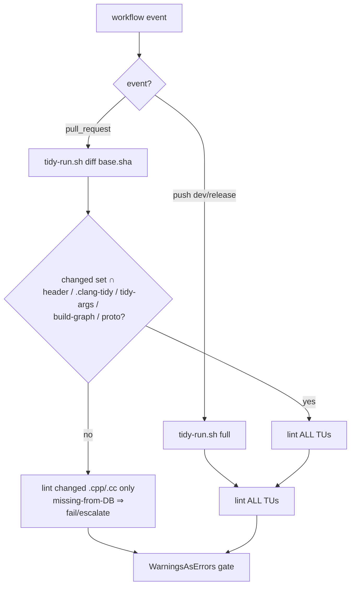

# perf: Diff-scope the PR clang-tidy gate

> **Provenance:** Reconstructed 2026-06-25 from session history (`16f32beb`). The
> original plan lived in a now-deleted worktree and was never committed. The
> substance — decisions, the shared-script design, the doc-review P0 fix folded
> in, and the units of work — is faithful to the session synthesis; exact wording
> is a reconstruction. **Re-run `/ce-doc-review` before implementing.**

## Summary

PR `tidy` lints all ~95 TUs every run (~21 min flat). Diff-scope it: on a
`pull_request`, lint **only the changed `.cpp`/`.cc` TUs** against the PR base
SHA, falling back to a **full** scan when the diff touches a header
(`*.h`/`*.hpp`), `.clang-tidy`, or `scripts/tidy-args.sh` (the header-filter hole
+ config-retriage cases). Add a **push-time full all-files tidy** on
`development` / `release/**` as a safety net. Extract the tidy logic — duplicated
byte-for-byte across `release-alpha.yml` and `release-beta.yml` — into a shared,
locally testable `scripts/ci/tidy-run.sh` with its own selection self-test.

---

## Problem Frame

clang-tidy cost is dominated by **TU count**: each of the ~95 TUs re-parses heavy
GStreamer/OpenCV headers, so the gate is ~21 min regardless of PR size. A PR
changes a handful of TUs but pays for all of them. The prebuilt-image work removed
the *image rebuild*; it did not touch the clang-tidy invocation, which is now the
PR long pole. (See origin: `docs/brainstorms/2026-06-24-tidy-diff-scope-requirements.md`.)

The load-bearing subtlety is `.clang-tidy`'s `HeaderFilterRegex: '(src|tests)/.*'`:
violations in project headers are only surfaced *while linting a TU that includes
them*. Diff-scoping to changed `.cpp` alone would let a header-introduced violation
escape — so header / config edits must escalate to a full scan, and a push-time
full scan backstops everything.

---

## Requirements

- R1. A PR changing only a few `.cpp`/`.cc` files (and no escape-hatch input)
  lints **exactly those changed TUs** and finishes materially faster than today's
  ~21 min flat — **target: under ~10 min for a 1–3 TU change** (the residual is the
  unconditional `cmake --preset test` + `sst_proto` build, which is unchanged; only
  the clang-tidy step shrinks). The achievable average depends on how often PRs hit
  the escape hatch — see Open Question OQ-G (header-touch rate).
- R2. A PR whose changed-file set includes any escape-hatch input — a header
  (`*.h`/`*.hpp`), `.clang-tidy`, `scripts/tidy-args.sh`, a build-graph file
  (`CMakeLists.txt`/`cmake/**`/`CMakePresets.json`/`conanfile.py`), or `proto/**` —
  runs a **full** tidy. *Limitation:* a violation introduced in a header that is
  included only by **unchanged** TUs (and not itself edited) is **not** caught on
  the PR; it relies on the push-time scan (see R-HOLE / Risks).
- R3. A **push** to `development` / `release/**` runs a **full** all-files tidy
  (D2 safety net).
- R4. The push-time full scan is **verified to actually fire** (closes the P0 in
  R-PUSH — the `changes`-job-on-push wiring).
- R5. The tidy hard gate is preserved **for changed/escalated TUs**:
  `WarningsAsErrors` still fails the run; a new violation in a changed (or
  escalated) TU still blocks the PR. **Honest scope (finding I):** the green-check
  semantics *narrow* — a green PR tidy now means "changed-TU-clean", not
  "whole-tree-clean". Whole-tree-clean is asserted only at the push-time full scan.
  This narrowing must be stated in CLAUDE.md's linting section so the team
  recalibrates the "green = clean tree" contract rather than holding a stale belief.
- R6. The floor-NOLINT guard is unchanged in behavior (diff-scoped, PR-only) and
  its self-test still passes.
- R7. The file-selection logic has its own **self-test** (R-SELECT).
- R8. No byte drift between the alpha and beta tidy jobs (extract to one script).
- R9. CLAUDE.md's linting section documents the narrowed green-check semantics and
  the escape-hatch behavior, so the team's "green = clean tree" contract is
  recalibrated rather than silently broken (finding I).

**Origin trace:** R1–R8 derived from the requirements doc's D1/D2 decisions,
escape-hatch conditions, success criteria, and the R-PUSH/R-SELECT/R-DRIFT risks.
R9 + the escape-hatch additions (build-graph, proto), the fail-open guards, and the
OQ-G/H/F premise questions were added by the 2026-06-25 doc review.

---

## Scope Boundaries

- No change to `.clang-tidy`'s check set or `scripts/tidy-args.sh` flags.
- No change to `format` / `test` jobs. (`ci-scripts` gains the tidy-run self-test
  step + shellcheck of the new scripts — U3.)
- No `ccache` / compile caching **in this plan** — but note OQ-H: it is the direct
  competitor to diff-scoping, not merely orthogonal, and must be weighed first.
- `release.yml` (`main`) stays promote-only; no tidy is added there. **Consequence
  (finding F, see OQ-F):** after this change no *blocking* job lints the full tree
  (PR is diff-scoped; push scan doesn't block; `main` only promotes). This is a
  deliberate residual to be accepted or closed via OQ-F, not an oversight.

### Deferred to Follow-Up Work

- `ccache` for the `cmake --preset test` build that feeds `compile_commands.json`
  (but see OQ-H — may belong *ahead* of this plan, not after).
- `LABELS hardware` retag of hardware-bound tests (touches `test`, not `tidy`).

---

## Context & Research

### Relevant Code and Patterns

- `.github/workflows/release-alpha.yml` — `tidy` job (PR-only:
  `if: github.event_name == 'pull_request' && needs.changes.outputs.code == 'true'`,
  `needs: [changes, image]`). Runs `cmake --preset test` +
  `cmake --build --preset test --target sst_proto`, then
  `find src tests \( -name '*.cpp' -o -name '*.cc' \) -not -path '*/_old/*' | xargs clang-tidy -p build/test "${TIDY_EXTRA_ARGS[@]}"`.
- `.github/workflows/release-beta.yml` — the `tidy` block is **byte-identical**
  (verified by diff). Both must change together → shared script.
- `changes` job (both files) — `dorny/paths-filter@v3`, currently
  `if: github.event_name == 'pull_request'`, output `code`. **Must run on push
  too for R3/R4.**
- `scripts/check-floor-nolints.sh` + `scripts/test-check-floor-nolints.sh` — the
  pattern to mirror: a diff-scoped guard (`base.sha...HEAD`, `fetch-depth: 0`)
  with a self-test that asserts the selection/bypass logic. The tidy job already
  calls both, so `base.sha` + full history are already in scope.
- `scripts/tidy-args.sh` — sourced for `TIDY_EXTRA_ARGS` (shared with
  `scripts/fix.sh`); the new script sources it the same way.

### Institutional Learnings

- The job `name:` values (`ci-scripts`/`format`/`tidy`/`test`) are the wired
  required status checks — keep them **byte-identical** (see `docs/ci/rulesets.md`).
- A job skipped by `if:` counts as **success** for required checks — which is
  exactly why the R-PUSH no-op is dangerous: a silently-skipped push tidy looks
  green.

### External References

- `dorny/paths-filter@v3` behavior on `push` vs `pull_request` (it diffs against
  `before`/base differently per event). Per decision 4 the push path no longer
  *reads* its `code` output, so its push reliability is moot — but the
  `needs:`-skip-propagation behavior of a job skipped on push is the load-bearing
  detail (see Institutional Learnings).

---

## Key Technical Decisions

1. **Diff base = `base.sha...HEAD` three-dot** on PR; reuse `fetch-depth: 0` +
   `github.event.pull_request.base.sha` already present for the floor guard.
   *Selection is fail-OPEN* (a mis-selected TU goes unlinted), the inverse of the
   floor guard's fail-closed posture — so the selection logic must be conservative
   (escalate / fail rather than silently drop; see decisions 2 & 6 and U1).
2. **Compute the changed-file set with NO pathspec restriction**
   (`git diff --name-only "${base}...HEAD"`), run the escape-hatch intersection
   over that **full** list, and *only after* deciding diff-vs-full filter the lint
   list down to src/tests `.cpp`/`.cc`. **Why (finding A):** `.clang-tidy` lives at
   repo root and `scripts/tidy-args.sh` under `scripts/` — a `-- 'src/**' 'tests/**'`
   pathspec filters them out *before* the intersection, so the config-edit escape
   hatch could never fire. Also avoid `**` directory globs (under-match in plain
   bash); use extension globs + a `^(src|tests)/` post-filter, the proven
   `scripts/check-floor-nolints.sh` technique.
3. **Escape hatch = full scan** if the changed-file set intersects ANY of:
   `*.h` / `*.hpp` (header-filter hole) · `.clang-tidy` / `scripts/tidy-args.sh`
   (check-set / flag retriage) · **`CMakeLists.txt` / `cmake/**` / `CMakePresets.json`
   / `conanfile.py` (build-graph: flags/defines/include-dirs/deps that can expose a
   violation in an unchanged TU) · `proto/**` (regenerated `*.pb.h`/`*.pb.cc`
   included by unchanged TUs)**. The build-graph + proto additions (finding C) close
   the same class of hole as the header rule: an input that changes what an
   *unchanged* TU compiles to.
4. **Push = always full scan, gated ONLY on the event** (finding B). On push to
   `development`/`release/**`, tidy runs `tidy-run.sh full` with **no dependence on
   `changes.outputs.code`** — because a `changes` job skipped on push would
   skip-propagate through `needs:` and silently no-op the safety net (skipped =
   green). `changes` must therefore *actually run on push* purely so the `needs:`
   edge isn't skipped, OR tidy must drop `changes` from `needs` on the push path.
   Do **not** read a `paths-filter` output on push (its `code` is unreliable on
   first-push / force-push / zero-SHA `before`).
5. **Extract `scripts/ci/tidy-run.sh`** taking explicit `mode` (`diff`|`full`) +
   `base` as **positional args** (`tidy-run.sh diff <base>` / `tidy-run.sh full`),
   matching `scripts/ci/resolve-version.sh` (finding L — one interface, not env +
   positional). The selection logic is a sourced function so the self-test can call
   it directly without invoking cmake/clang-tidy (finding J).
6. **The build is unconditional.** Always `cmake --preset test` +
   `--target sst_proto` first; only the clang-tidy file list varies. A changed
   `.cpp`/`.cc` that is **absent from `compile_commands.json`** (e.g. a new file not
   yet wired into a CMake target) is a **fail/escalate**, never a silent skip
   (finding D — fail-open on new code is exactly the case the gate most needs).

---

## Open Questions

### Resolved During Planning

- Diff-scope vs full on PR → **diff-scope with header/config/build-graph/proto
  escape hatch** (D1) — *contingent on OQ-G/OQ-H below*.
- How to cover the header-filter hole → **escape hatch (the real prevention) +
  push-time full scan (a fast alarm, not a merge gate)**, not "lint includers".
- Edit two inline blocks vs extract → **extract one shared script** (R-DRIFT).

- `paths-filter` semantics on push → **decided (decision 4):** push tidy never
  reads `changes.code`; `changes` runs on push only to avoid `needs:`
  skip-propagation. No longer open.
- Changed-file list source → **decided (decision 2):** `git diff` in the script,
  no pathspec, escalation over the full list.

### Premise & strategy — UNRESOLVED, decide before implementing

These came out of the doc review (product-lens) and challenge whether this plan is
the *right* approach, not just whether it's correctly specified. They are recorded
here rather than silently resolved.

- **OQ-G — Is the speed win real for THIS codebase? (measure first.)** The escape
  hatch escalates any header-touching PR to a full scan. This is a hexagonal C++
  tree where ports, domain entities/value objects, and the mandatory per-model
  `fmt::formatter` specializations all live in **headers** (~178 headers vs ~95
  TUs). If most substantive PRs edit a header, they escalate to full and the
  diff-scope win evaporates — diff-scoping then helps only the trivial-`.cpp`-tweak
  minority. **Action: measure the zero-header-touch rate over the last 20–50 merged
  PRs before building.** That single number decides whether the premise holds.
- **OQ-H — Is diff-scoping even the right lever vs a coverage-preserving fix?** The
  stated root cause is *per-TU header reparse*. A compile-cache (PCH/ccache) or
  **sharding the existing full scan across a runner matrix** (e.g. 95 TUs / 4
  runners ≈ ~5 min) attacks that same cost with **zero** coverage hole, **zero**
  "PR passes / push blocks" asymmetry, and keeps the "green = clean tree" contract.
  The plan currently dismisses ccache as "orthogonal" in one line — it is the direct
  competitor. **Action: spike a parallel-matrix full scan and/or ccache and compare
  wall-time before committing to diff-scope's coverage tradeoff.** If sharding gets
  the gate under an acceptable threshold, the coverage hole is never needed.
- **OQ-F — Does any blocking job lint the WHOLE tree after this change?** Removing
  the PR full scan + `main` being promote-only means **no blocking gate ever lints
  the full tree** (the push scan doesn't block the merge; see U2 finding E).
  **Action: decide** — accept that residual explicitly, OR add a blocking full tidy
  on the `release/** → main` PR (the last gate before stable), OR make the
  release-build job `needs:` the push tidy (blocks the binary, not the merge).

### Pre-existing repo inconsistency to reconcile (not introduced here)

- **clang-tidy v14 vs v18.** `.clang-tidy`'s header says "VERSION-LOCKED to
  clang-tidy-14 (jammy)", while CLAUDE.md and this plan say "noble v18". The repo is
  internally inconsistent on the pinned version. This plan proposes **no** version
  change, so it doesn't depend on the answer — but the self-test's escalation
  assertions and the check-set baseline inherit whichever is real. Reconcile
  `.clang-tidy`'s header with the actual devcontainer toolchain as a separate
  cleanup.

---

## High-Level Technical Design

> *Directional guidance for review, not implementation specification.*

`tidy-run.sh` always runs the build first, then selects the file list per
`mode`+`base`, then `xargs clang-tidy -p build/test "${TIDY_EXTRA_ARGS[@]}"`. The
selection branch is what the self-test exercises.

---

## Implementation Units

- U1. **`scripts/ci/tidy-run.sh` — shared, mode-driven tidy runner**

**Goal:** One script encapsulating build + file-selection + clang-tidy, replacing
the inline block in both workflows.

**Requirements:** R1, R2, R5, R8

**Dependencies:** None

**Files:**
- Create: `scripts/ci/tidy-run.sh`

**Approach:**
- **One interface — positional args** (finding L): `tidy-run.sh <mode> [base]`
  where `mode` ∈ `diff`|`full`; matches `scripts/ci/resolve-version.sh`. No env-var
  primary. CI calls `tidy-run.sh diff <base.sha>` / `tidy-run.sh full`.
- **Structure for testability** (finding J): the **file-selection logic is a sourced
  function** `select_tidy_files(mode, base)` that emits the chosen mode + file list
  on stdout and touches neither cmake nor clang-tidy. The script's main body calls
  it, runs the build, then lints. The self-test (U3) sources the script and calls
  the function directly — no "dry-run flag" branch in the production path.
- Always (main body): `cmake --preset test` +
  `cmake --build --preset test --target sst_proto` — so `compile_commands.json` and
  the protobuf headers exist before linting.
- `full` → `files=$(find src tests \( -name '*.cpp' -o -name '*.cc' \) -not -path '*/_old/*')`
  (today's exact list).
- `diff` selection (finding A — pathspec hole):
  1. `changed=$(git diff --name-only "${base}...HEAD")` — **no pathspec**, the whole
     changed-file set (so root-level + `scripts/` paths are visible to the test below).
  2. **Escalate to `full`** (log the reason) if `changed` intersects the escape-hatch
     set: `*.h` / `*.hpp` / `.clang-tidy` / `scripts/tidy-args.sh` / `CMakeLists.txt`
     / `cmake/**` / `CMakePresets.json` / `conanfile.py` / `proto/**` (decision 3).
  3. Otherwise `files = changed`, filtered to `^(src|tests)/.*\.(cpp|cc)$` and the
     `_old/` exclusion (finding O — the diff path needs the `_old/` filter too).
  4. **DB-membership (finding D):** for each remaining file, if it is **absent from
     `compile_commands.json`** but **present in the working tree**, FAIL with a clear
     message (a changed-but-uncompiled TU is a wiring hole, not a no-op). A file that
     is gone from the tree (deleted/renamed away) is simply dropped.
- Empty file list **after a `.md`-only-style diff** (no C++ TUs changed, no
  escalation) → log "no C++ TUs to tidy" and **exit 0** — benign; the job is already
  gated. Empty list **after escalation to full** (e.g. a header/config edit with no
  `.cpp`/`.cc` changed) → also **exit 0** with "escalated to full, no TUs to lint".
  The full path's `exit 1`-on-empty is reserved for a degenerate tree with zero TUs,
  not a selective-PR case (finding N).
- `source scripts/tidy-args.sh`; `echo "$files" | xargs clang-tidy -p build/test "${TIDY_EXTRA_ARGS[@]}"`.

**Patterns to follow:** `scripts/check-floor-nolints.sh` (three-dot diff, base-ref
resolution, extension-glob + `^(src|tests)/` post-filter, `set -euo pipefail`); the
existing inline tidy step for the build + `tidy-args` sourcing;
`scripts/ci/resolve-version.sh` for the positional-arg interface.

**Test scenarios:** see U3 (self-test).

**Verification:** running `scripts/ci/tidy-run.sh full` in the devcontainer
reproduces today's tidy result on a clean tree.

---

- U2. **Wire both workflows: PR diff-scoped + push full (P0 fix folded in)**

**Goal:** `tidy` runs `tidy-run.sh diff` on PR and `tidy-run.sh full` on push, and
the push path **actually fires**.

**Requirements:** R1, R3, R4, R6

**Dependencies:** U1

**Files:**
- Modify: `.github/workflows/release-alpha.yml`, `.github/workflows/release-beta.yml`

**Approach (the doc-review P0 fix is mandatory here — ONE design, no alternatives
left open; finding B):**
- **Push tidy is gated ONLY on the event and never reads `changes.outputs.code`.**
  The `if:` is:
  `if: ${{ (github.event_name == 'pull_request' && needs.changes.outputs.code == 'true') || github.event_name == 'push' }}`.
- **`changes` MUST actually run on push** (remove its
  `if: github.event_name == 'pull_request'`, or scope it to the push branches) —
  **not** so tidy can read it, but so the `needs: [changes, image]` edge does not
  **skip-propagate**: a `needs:` dependency skipped on push skips the dependent even
  when its own `if:` would otherwise run it (skipped = green = silent no-op safety
  net). Keep `needs: [changes, image]` on tidy.
  - *Equivalent alternative, pick exactly one:* drop `changes` from tidy's `needs`
    on the push path entirely. Do **not** ship both the half-measures together — the
    failure mode the original draft risked was reading `changes.code` on push while
    `changes` stayed PR-only.
  - Do **not** depend on `dorny/paths-filter`'s `code` output on push — it is
    unreliable on first-push / force-push / zero-SHA `before`, exactly the
    `release/**`-branch-creation moment the scan most needs to fire.
- **Pass mode/base into the step (positional, per U1):**
  - PR: `tidy-run.sh diff ${{ github.event.pull_request.base.sha }}`.
  - push: `tidy-run.sh full` (no base).
- **Floor-NOLINT guard stays PR-only** — gate its two steps on
  `if: github.event_name == 'pull_request'` (it diffs against a PR base that does
  not exist on a branch push).
- Replace the inline `bash -lc '…'` tidy body with a call to
  `scripts/ci/tidy-run.sh` inside the same `docker run`.
- Keep job **names** byte-identical; keep `image` pull (the `image` job has no `if:`
  so it already runs on push), conan cache, qemu setup.
- Apply the **same** edits to both files (now thin — they call one script).

**The push scan is detection-after-the-fact, NOT a merge gate (finding E — stated
honestly):** a `push` to `development`/`release/**` fires *on the merge*, so the
violating code is already on the shared branch when the scan runs; and the alpha/beta
release job on that same push does **not** `needs:` tidy, so a tainted binary can be
built/published while (or despite) the scan failing. The push scan therefore (a)
red-bars the shared branch for everyone who pulls next and (b) does not actually
prevent a bad merge or a bad release. Two consequences folded into this plan:
- **R-HOLE is an accepted, bounded residual, not "closed".** The only real
  prevention for a header/build-graph violation that escapes a diff-scoped PR is the
  *escape hatch* (escalate-to-full on the PR). The push scan is a fast alarm, not a
  wall.
- **Make the release (alpha/beta) cross-build+publish job `needs:` the push tidy**
  so a failing full scan cannot publish a tainted binary. (This is the one place the
  scan can be made to actually block something — the binary, not the merge.) See
  also OQ-F on whether a blocking full lint belongs on the `release/** → main` PR.

**Patterns to follow:** the existing `docker run --rm --user root … bash -lc`
wrapper; the floor-guard's `base.sha` usage.

**Test scenarios:**
- PR, `src/foo.cpp` only → diff mode, lints just `foo.cpp`.
- PR, edits `src/bar.hpp` → escalates to full.
- PR, edits `.clang-tidy` → escalates to full.
- Push to `development` → full scan runs (R-PUSH closed) — **must be confirmed on
  a live push**.
- Push to `release/**` → full scan runs.

**Verification (BLOCKING):** after merge, trigger a real push to `development`
(or `release/**`) and confirm in the run logs that `changes` ran, `tidy` was
**not skipped**, and it executed a **full** scan. This is the P0 that a naïve
implementation silently breaks.

---

- U3. **`scripts/ci/test-tidy-run.sh` — selection self-test**

**Goal:** Assert the file-selection / escalation branch, so a regression can't
silently skip a merge-blocking lint.

**Requirements:** R7

**Dependencies:** U1

**Files:**
- Create: `scripts/ci/test-tidy-run.sh`
- Modify: `.github/workflows/release-alpha.yml` / `release-beta.yml` to run it in
  `ci-scripts` (host-side, no devcontainer — mirror `resolve-version-test.sh`).

**Approach (no dry-run flag; finding J):**
- **Call the `select_tidy_files` function directly.** The self-test `source`s
  `tidy-run.sh` and invokes the selection function over a synthetic temp git repo,
  asserting the emitted mode + file list. The function never calls cmake/clang-tidy,
  so no production-only "dry-run" branch is needed. For the cases that *do* reach the
  build/lint (e.g. asserting the DB-membership failure), **stub `cmake` and
  `clang-tidy` as no-op shell functions on `PATH`** — the technique
  `resolve-version-test.sh` already uses to stub `git` — and assert the echoed file
  list / exit code. This keeps the production path clean (scope reviewer's point).
- Cases asserted:
  - changed `.cpp` only → mode `diff`, exactly that file selected.
  - changed `.hpp` → escalates to `full`.
  - changed `.clang-tidy` / `scripts/tidy-args.sh` → `full`.
  - **changed `CMakeLists.txt` / `CMakePresets.json` / `conanfile.py` / `cmake/**`
    → `full`** (build-graph escalation, finding C).
  - **changed `proto/**` → `full`** (finding C).
  - changed `*.md` only → empty list, exit 0 (benign no-op).
  - **changed `.cpp` present in tree but absent from a fixture
    `compile_commands.json` → FAIL** (fail-open guard, finding D).
  - `_old/` path changed → excluded.
  - `mode=full` → all TUs, ignores base.
- Pure host bash + git; no sysroot. Add `shellcheck scripts/ci/tidy-run.sh
  scripts/ci/test-tidy-run.sh` to the existing `ci-scripts` shellcheck step.

**Patterns to follow:** `scripts/test-check-floor-nolints.sh` (synthetic-repo
fixture, asserts each selection class); `ci-scripts` job wiring of
`resolve-version-test.sh` (incl. PATH-stub of `git`).

**Coverage caveat (finding K):** `ci-scripts` is PR-only
(`if: github.event_name == 'pull_request'`), so this self-test does **not** run on
the push event that triggers the full-scan safety net. The selection logic is static
(same code on PR and push), so a PR-time pass implies the push path's selector is
sound; the residual — that a regression merged without a PR could go untested on its
first push — is covered by U2's BLOCKING live-push verification. If stronger push
coverage is wanted, run the self-test inside the `tidy` job (which fires on both
events) instead of `ci-scripts`.

**Test scenarios:** the self-test *is* the scenarios; it must fail if any
selection branch regresses.

**Verification:** `./scripts/ci/test-tidy-run.sh` passes locally and in
`ci-scripts`; deliberately breaking the escalation check (or the DB-membership
guard) makes it fail.

---

## Risks & Mitigations

- **R-PUSH (P0):** push-time full scan silently no-ops if `changes` stays PR-only
  and tidy `needs: [changes]` skip-propagates. → decision 4 + U2: `changes` runs on
  push (or tidy drops it from `needs`), tidy `if:` covers push and never reads
  `changes.code`, + **blocking live-push verification**.
- **R-PATHSPEC (P0):** the escape-hatch intersection misses root-level / `scripts/`
  inputs if the diff is pathspec-filtered to `src/**`/`tests/**`. → decision 2:
  diff with no pathspec, intersect over the full list, filter to src/tests last.
- **R-SELECT:** a wrong selection skips a lint (fail-open). → U3 self-test in
  `ci-scripts` (PR-only — push covered by live-push verify; see U3 caveat).
- **R-NEWFILE:** a changed `.cpp` absent from `compile_commands.json` (new,
  unwired) is silently unlinted. → decision 6 / U1: missing-from-DB ⇒ fail/escalate.
- **R-DRIFT:** alpha/beta tidy blocks diverge. → U1 single shared script.
- **R-HOLE (accepted, bounded):** a violation in a header / build-graph input that
  reaches only **unchanged** TUs escapes a diff-scoped PR. The escape hatch
  (escalate-to-full on any such input — decision 3) is the *prevention*; the
  push-time full scan is a *post-merge alarm, not a merge gate* (it fires after the
  code is on the shared branch and does not block the release job). Residual
  ownership: OQ-F decides whether a blocking full lint is added before `main`.

---

## Acceptance Criteria

- [ ] **OQ-G/OQ-H answered first:** zero-header-touch PR rate measured, and
      diff-scope chosen over (or alongside) ccache/parallel-matrix with that data in
      hand. If the data kills the premise, this plan does not ship as written.
- [ ] `scripts/ci/tidy-run.sh` exists; `tidy-run.sh full` reproduces today's result.
- [ ] PR `tidy` lints only changed `.cpp`/`.cc`; a changed header, `.clang-tidy`,
      `scripts/tidy-args.sh`, build-graph file (`CMakeLists.txt`/`cmake/**`/
      `CMakePresets.json`/`conanfile.py`), or `proto/**` escalates to **full**.
- [ ] A changed `.cpp` present in the tree but absent from `compile_commands.json`
      **fails** the job (does not silently skip).
- [ ] Push to `development`/`release/**` runs a **full** tidy — **verified on a
      live push** (logs show `changes` ran + `tidy` not skipped + full scan).
- [ ] `scripts/ci/test-tidy-run.sh` passes in `ci-scripts`; breaking escalation or
      the DB-membership guard fails it.
- [ ] Floor-NOLINT guard unchanged (PR-only) and its self-test passes.
- [ ] alpha and beta tidy jobs call the same script (no byte drift).
- [ ] Job names `ci-scripts`/`format`/`tidy`/`test` unchanged (required checks).
- [ ] CLAUDE.md linting section states the narrowed "green PR = changed-TU-clean"
      semantics (R5).
- [ ] OQ-F resolved: a blocking full-tree lint exists before `main`, or its absence
      is explicitly accepted.
